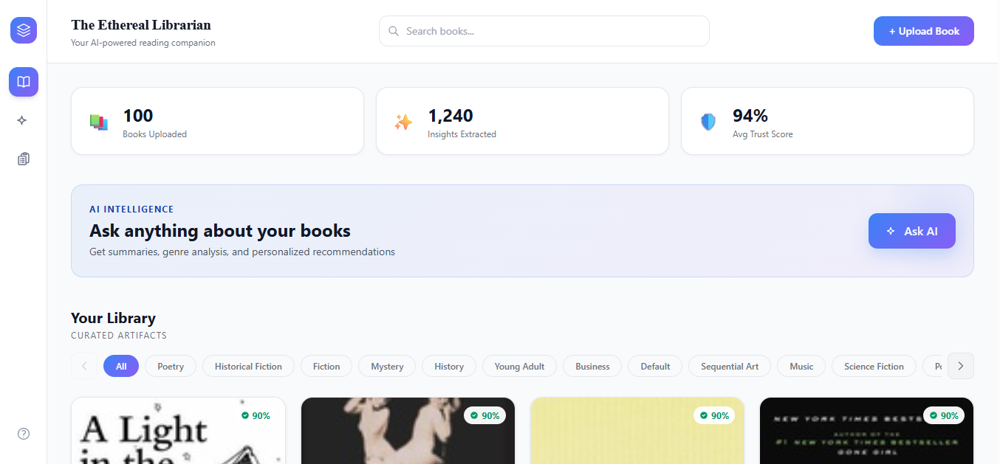
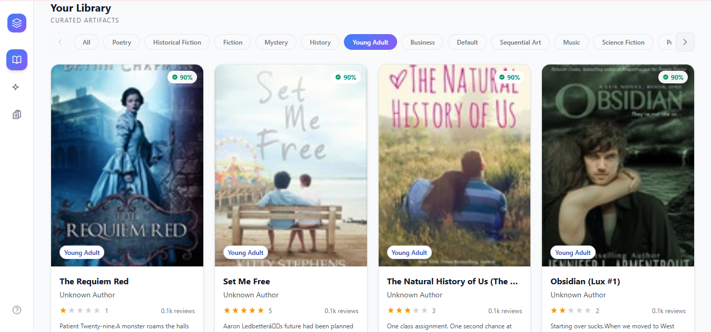
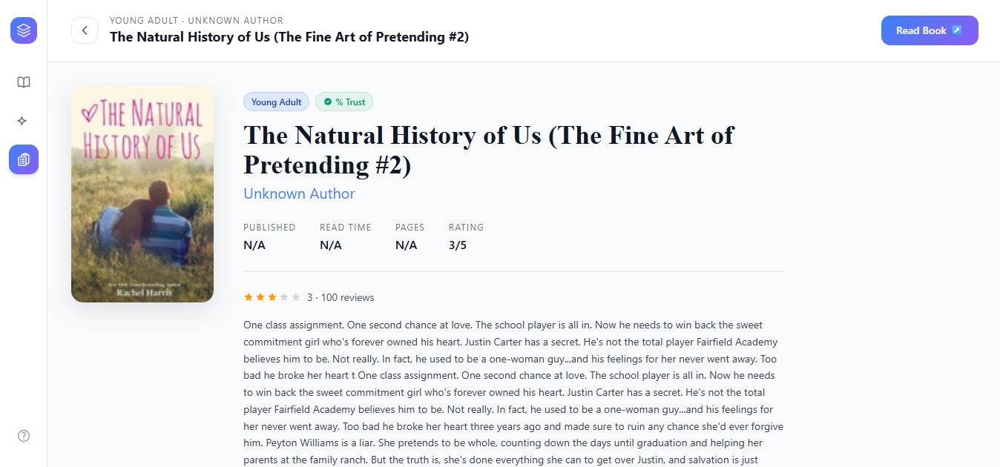
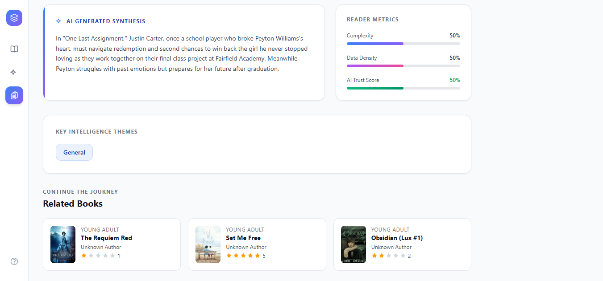
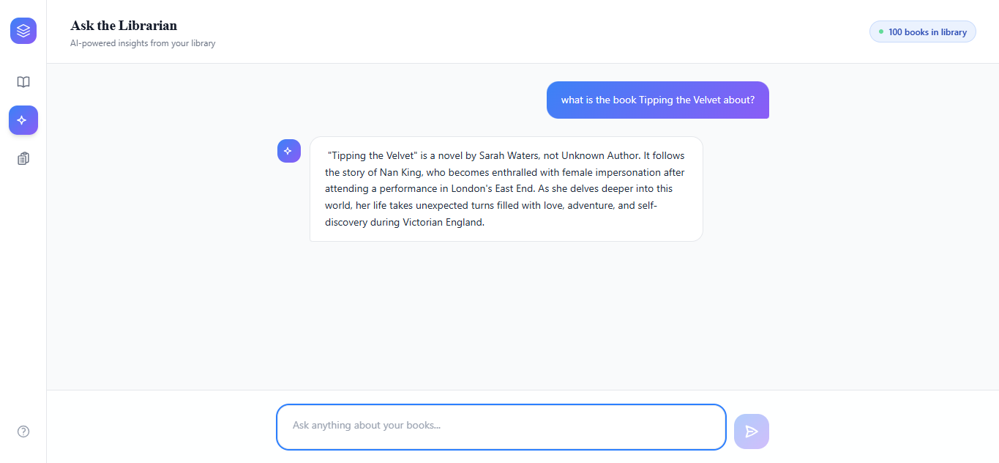
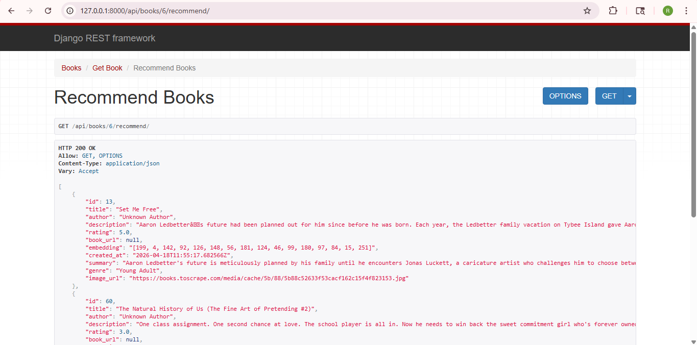

# The Ethereal Librarian

### AI-Powered Document Intelligence Platform (RAG-based Book System)

---

## Overview

This project is a **full-stack AI-powered book intelligence platform** built as part of the Ergosphere Solutions assignment.

The system:

* Scrapes book data from the web
* Stores and manages it in a backend
* Generates AI-based insights
* Supports question-answering using RAG
* Exposes functionality via REST APIs
* Provides a modern frontend interface

---

## Features

### Data Collection

* Automated scraping from *books.toscrape.com*
* Multi-page scraping
* Extracts:

  * Title
  * Description
  * Genre
  * Rating
  * Cover Image

---

### AI Capabilities

* AI Summary Generation
* Genre Classification
* RAG-based Question Answering
* Book Recommendation System (Genre-based)

---

### RAG Pipeline

The system follows a complete RAG flow:

1. Convert user query → embedding
2. Retrieve similar books using cosine similarity
3. Build contextual input
4. Generate answer using LLM

---

## Backend (Django REST Framework)

### GET APIs

* `/api/books/` → List all books
* `/api/books/<id>/` → Book detail
* `/api/books/<id>/recommend/` → Related books

### POST APIs

* `/api/books/scrape/` → Trigger scraping
* `/api/books/ask/` → Ask questions

---

## Frontend (React + Tailwind CSS)

* Dashboard (book listing)
* Book detail page
* AI summary display
* Q&A interface
* Genre filtering (scrollable)
* Recommendation section

---

## Screenshots

### Dashboard

---

### Book Listing (Genre Filter)

---

### Book Detail Page

---

### AI Generated Summary

---

### Related Books (Recommendations)

---

### Ask AI (RAG Q&A)

---

### Backend API (Recommendation Endpoint)

---

## Sample Questions

* What is this book about?
* Summarize this book
* Recommend similar books
* What genre is this book?

---

## Sample Output

**Q:** What is the book *Tipping the Velvet* about?

**A:**
The book follows a young protagonist navigating identity, relationships, and personal growth based on the provided description.

---

## Tech Stack

| Layer      | Technology            |
| ---------- | --------------------- |
| Backend    | Django REST Framework |
| Frontend   | React + Tailwind CSS  |
| AI         | LM Studio (Local LLM) |
| Embeddings | Custom embedding      |
| Database   | SQLite                |
| Scraping   | BeautifulSoup         |

---

## Setup Instructions

### 🔹 Backend

cd bookai_backend
pip install -r requirements.txt
python manage.py runserver

---

### 🔹 Frontend

cd bookai_frontend
npm install
npm run dev

---

## Project Structure

book-ai-project/
│
├── bookai_backend/
│   ├── books/
│   ├── scraper.py
│   ├── views.py
│   ├── requirements.txt
│
├── bookai_frontend/
│   ├── src/
│   ├── App.jsx
│   ├── package.json
│

---

## Design Decisions

* Used **real genre from scraping** instead of AI for accuracy
* Implemented **genre-based recommendations** for simplicity
* Used **LM Studio** for local AI inference
* Used **cosine similarity** instead of FAISS

---

## Limitations

* Author data unavailable → shown as "Unknown Author"
* No vector DB (FAISS/Chroma)
* Basic RAG (no chunking)

---

## Future Improvements

* Add FAISS/ChromaDB
* Add caching
* Improve metadata extraction
* Add chat history

---

## Conclusion

This project successfully fulfills all assignment requirements:

✔ Data scraping
✔ AI insights
✔ RAG Q&A
✔ REST APIs
✔ Frontend UI

---

## Submission Note

This implementation follows all guidelines from the assignment document, including:

* Screenshots
* API documentation
* Setup instructions
* Sample Q&A

---
